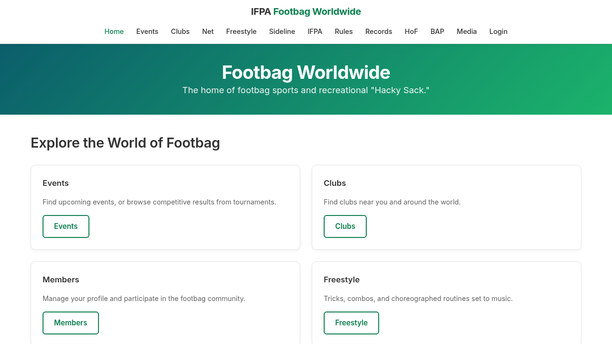
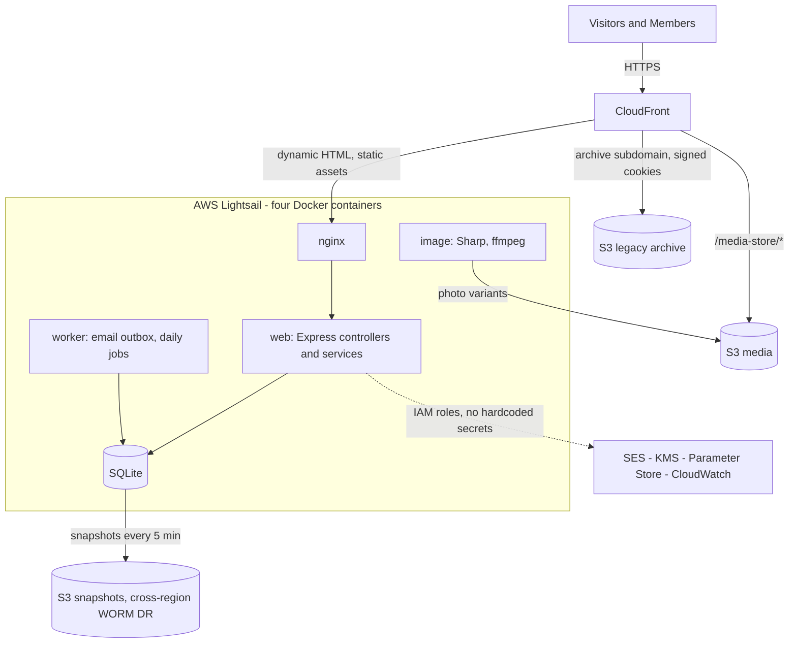

# footbag-platform

[](https://github.com/davidleberknight/footbag-platform/actions/workflows/ci.yml)
[](LICENSE)

> Modernizing **footbag.org** under the auspices of the **International Footbag Players Association (IFPA)**.

This repository contains the open-source modernization project for the global footbag community.

- **Maintainer:** [David Leberknight](https://github.com/davidleberknight) (initially hosted on David's personal GitHub account)
- **Institutional context:** Developed under IFPA auspices
- **Goal:** A simple, low-cost, volunteer-maintainable platform for long-term community use

Legacy site (HTTP only): [http://www.footbag.org/](http://www.footbag.org/)

[](https://doye1nvv64qep.cloudfront.net/)

## Start Here

- **Humans:** read [docs/PROJECT_SUMMARY.md](docs/PROJECT_SUMMARY.md)
- **AI tools:** read [PROJECT_SUMMARY_CONCISE.md](PROJECT_SUMMARY_CONCISE.md)

**Active project planning, operations, and anything private or otherwise not suitable for this public GitHub repo** live in a private repository. This includes `DEVOPS_GUIDE.md`, `AWS_OPERATIONS.md`, the GitHub Issues task-tracking board, separate bug tracking, and more. The separate repo also holds archived and private data, and IFPA-internal docs and archives.

## Current Project State

Most functionality required for Go-Live is done and deployed on AWS. This is the baseline for ongoing work.

Sneak Preview (AWS Staging): [https://doye1nvv64qep.cloudfront.net/](https://doye1nvv64qep.cloudfront.net/)

- We are actively revising the User Stories to define the Minimum Viable Product (MVP) scope. We will add some new stories with the goal to fully eliminate the need to keep the legacy site running in parallel.

## Quickstart

Requires Node 22; `sqlite3` and `python3` are needed for the seeded local database (full setup in [docs/DEV_ONBOARDING.md](docs/DEV_ONBOARDING.md)).

```bash
git clone https://github.com/davidleberknight/footbag-platform.git
cd footbag-platform
npm install
./run_dev.sh   # first run seeds the database, then serves the site locally
npm test       # unit and integration tiers
```

## Architecture



The full diagram set (infrastructure topology, four-layer software architecture, auth and request flows, environment parity) is in [docs/DIAGRAMS.md](docs/DIAGRAMS.md).

## Claude Code

This repository doubles as a worked example of a production Claude Code harness:

- [CLAUDE.md](CLAUDE.md): the always-loaded operating rules (authority order, non-negotiable rules, workflow). The AI loads this file first, every session.
- [docs/CLAUDE_CODE_GUIDE.md](docs/CLAUDE_CODE_GUIDE.md): how and why the harness is built this way, section by section, mapped to Anthropic's published best practices.
- 17 skills (repeatable procedures), 16 path-scoped rules (per-layer coding conventions), and 14 fixture-tested hooks, including an obfuscation-resistant read-only Bash auto-approver and a Stop hook that blocks low-quality questions to the human.
- Defense in depth: a version-proof permission floor in `.claude/settings.json` with guard hooks layered on top, and a CI self-check (`scripts/ci/assert_claude_harness.sh`) that fails the build when the harness drifts.

## Contributing

- Talk to Dave.
- You can run this code locally (see Quickstart above), but to contribute you must have an invitation to the private repo. 
- [CONTRIBUTING.md](CONTRIBUTING.md).
- [SECURITY.md](SECURITY.md) for vulnerability reporting (Bug reporting is in the separate private GitHub repo).
- **Do not report security vulnerabilities in public.** 

## Project Documentation

- [docs/CLAUDE_CODE_GUIDE.md](docs/CLAUDE_CODE_GUIDE.md): AI coding instructions as rules, procedures as skills, question-asking scheme, guardrails, and token-use efficiency / context-window management harness.
- [docs/DATA_MODEL.md](docs/DATA_MODEL.md): data model and schema semantics.
- [docs/DESIGN_DECISIONS.md](docs/DESIGN_DECISIONS.md): architectural decisions and rationale.
- [docs/DEV_ONBOARDING.md](docs/DEV_ONBOARDING.md): developer setup and onboarding, but not contributing (refer to private GitHub repo).
- [docs/DIAGRAMS.md](docs/DIAGRAMS.md): solution architecture diagrams.
- [docs/GLOSSARY.md](docs/GLOSSARY.md): terminology and jargon.
- [docs/MIGRATION_PLAN.md](docs/MIGRATION_PLAN.md): migration design, the pipeline validation gates, and the operational-readiness posture; the go-live gate index, cutover sequencing, and stakeholder coordination live in GO_LIVE_PLAN.md (private GitHub repo).
- [docs/PROJECT_SUMMARY.md](docs/PROJECT_SUMMARY.md): project overview.
- [docs/TESTING.md](docs/TESTING.md): testing strategy and methodology.
- [docs/USER_STORIES.md](docs/USER_STORIES.md): intended functional behaviors and success criteria.

NOTE: `DEVOPS_GUIDE.md` and `AWS_OPERATIONS.md` are private, along with Project Management tools.

## Technology Stack

TypeScript · Node.js · Express · Handlebars · SQLite · AWS (Lightsail, S3, SES, CloudFront, Route53) · Docker · Terraform · Stripe 

## License and Trademarks

- Code in this repository is licensed under the **Apache License 2.0**; see [LICENSE](LICENSE).
- IFPA names, logos, and marks are **not** granted under Apache-2.0; see [TRADEMARKS.md](TRADEMARKS.md).

---

*Built for the global footbag community.*